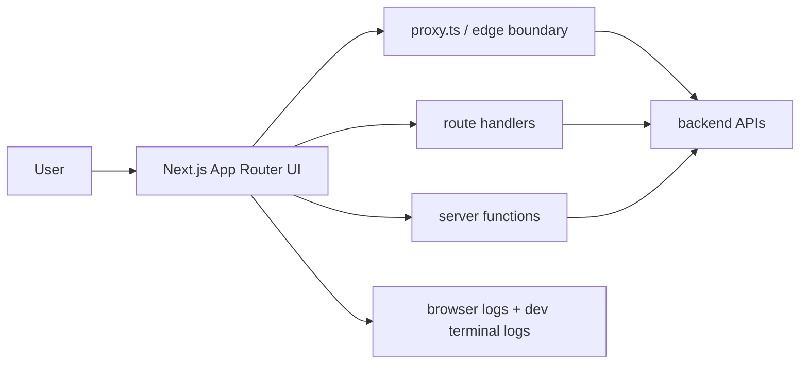

# Architecture Memory

Use this file as the compact architecture map that Claude can read when structure matters.

## What belongs here
- Route groups, key app surfaces, and important boundaries
- Server versus client ownership
- Proxy, auth, and API entry points
- Observability paths such as browser logs and terminal logs

## Starter example
- Route groups: `(marketing)`, `(app)`, `(admin)`
- Auth boundary: `proxy.ts` checks session cookie before protected routes
- Data boundary: route handlers fan out to backend APIs, client components stay interactive-only
- Debugging path: browser logs forwarded in dev, server logs in terminal, Sentry in production

## Keep it short
- Prefer durable structure over implementation detail
- Update this file only when architecture actually changes
- Replace the starter example with real project facts as soon as the project is onboarded
